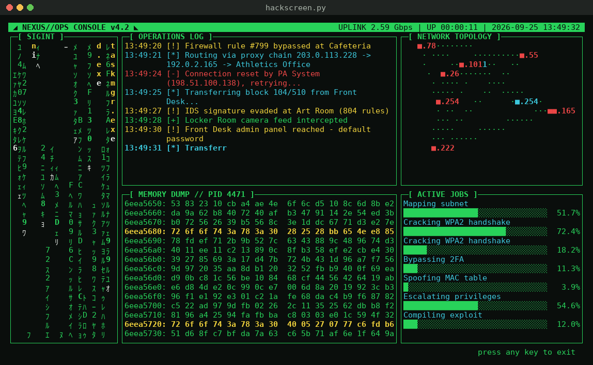

# hackscreen


-brightgreen)

A text-based terminal screensaver, written in Python, that looks like a movie-style "internet hacking system": Matrix rain with falling Windows filenames, a live operations log, a network topology map, a scrolling memory dump, progress bars, and flashing alerts.



> **It's all fake.** hackscreen makes **no network connections** and never reads or modifies your files. Every IP address comes from the [RFC 5737](https://www.rfc-editor.org/rfc/rfc5737) documentation ranges (`192.0.2.0/24`, `198.51.100.0/24`, `203.0.113.0/24`), which are reserved for examples and never assigned to real hosts. All hashes, hex bytes, and targets are randomly generated.

---

## Features

| Panel | What it shows |
|---|---|
| **SIGINT** | Matrix-style rain of half-width katakana and hex digits. Recognizable Windows filenames (`explorer.exe`, `lsass.exe`, `NTUSER.DAT`, `System32`, ...) fall through it in yellow, and the whole name blinks just before it hits the ground. |
| **OPERATIONS LOG** | Timestamped, typed-out log lines "attacking" school locations such as the Cafeteria, Test Room, Video Game Arena, Principal's Office, and Main Office. Long lines wrap neatly under the message. |
| **NETWORK TOPOLOGY** | Randomly generated network nodes with packets traveling between them. Nodes turn red as they are "compromised." |
| **MEMORY DUMP** | `xxd`-style hex dump. Lines containing strings like `password` or `admin:` are highlighted. |
| **ACTIVE JOBS** | Progress bars for fake tasks that occasionally stall dramatically around 97%. |
| **Alerts** | Every 20-45 seconds, a blinking banner such as `ACCESS GRANTED` or `INTRUSION DETECTED`. |

The layout also:

* Adapts to the terminal size.
* Rebuilds itself when the window is resized.
* Shows a friendly message if the window is smaller than 70x20.
* Exits cleanly and restores the terminal on any keypress or `Ctrl+C`.

---

## Requirements

| | Linux | macOS | Windows |
|---|---|---|---|
| Python 3.8+ | Required | Required | Required |
| `curses` | Built into Python | Built into Python | `windows-curses` from PyPI (the installer handles it) |
| `tmux` (optional) | For idle-triggered screensaver mode | For idle-triggered screensaver mode | Not available natively. Use WSL. |
| Terminal | UTF-8 locale, 70x20 minimum | UTF-8 locale, 70x20 minimum | Windows Terminal recommended |

---

## Installation

### Option 1: guided installer (recommended)

```bash
git clone https://github.com/jdelvalle/hackscreensaver.git
cd hackscreen
python3 install.py
```

On Windows, use `python` or `py` instead of `python3`.

The installer:

1. **Detects the operating system.** On Linux it identifies the distribution from `/etc/os-release` and also recognizes WSL.
2. **Verifies the required dependencies:** the Python version and the `curses` module. On Windows, it offers to install `windows-curses` with pip, and offers to bootstrap pip with `ensurepip` if pip is missing.
3. **Checks the terminal environment:** whether the locale uses UTF-8 and whether it's running in an interactive terminal.
4. **Offers to install `tmux`** (optional) using the package manager it finds on the system:

   | System | Package manager |
   |---|---|
   | Debian / Ubuntu | `apt-get` |
   | Fedora / RHEL | `dnf` or `yum` |
   | Arch | `pacman` |
   | openSUSE | `zypper` |
   | Alpine | `apk` |
   | macOS | `brew` |
   | FreeBSD | `pkg` |

5. **Copies the program and creates a `hackscreen` launcher.**
6. **Optionally configures tmux** so the screensaver starts after a period of inactivity.

**Every change requires your explicit `y`, and the default answer is No.** Before running a package-manager command, the installer shows you the exact command, including `sudo`. Before editing `~/.tmux.conf`, it backs up the file with a timestamp and shows the lines it will add. Running the installer again never adds those lines twice.

To check dependencies without changing anything:

```bash
python3 install.py --check
```

**Install locations:**

| | Program | Launcher |
|---|---|---|
| Linux / macOS | `~/.local/share/hackscreen/hackscreen.py` | `~/.local/bin/hackscreen` |
| Windows | `%LOCALAPPDATA%\hackscreen\hackscreen.py` | `%LOCALAPPDATA%\hackscreen\hackscreen.cmd` |

### Option 2: run it directly

On Linux and macOS there's nothing to install:

```bash
python3 hackscreen.py
```

On Windows, install the one dependency first:

```powershell
py -m pip install -r requirements.txt
py hackscreen.py
```

`requirements.txt` uses an environment marker, so `pip install -r requirements.txt` is safe on any OS. It installs nothing on Linux or macOS.

---

## Usage

```bash
hackscreen            # if the launcher is on your PATH
python3 hackscreen.py # or run the script directly
```

Press **any key** to exit.

### Screensaver mode (tmux)

A terminal has no built-in way to detect when you're idle, so hackscreen uses tmux's lock feature. The installer can set this up for you, or you can add the following to `~/.tmux.conf` yourself:

```tmux
set -g lock-after-time 300                 # seconds of inactivity (5 minutes)
set -g lock-command "hackscreen"           # or the full path to the launcher
```

Reload the configuration from inside tmux:

```bash
tmux source-file ~/.tmux.conf
```

This only affects terminals running inside a tmux session. Note that `lock-command` just runs the screensaver; it does **not** require a password to dismiss it. Don't rely on hackscreen as a security lock.

---

## Customization

The most common tweaks are constants near the top of `hackscreen.py`:

| Constant | Purpose |
|---|---|
| `SCHOOL_TARGETS` | Location names used in the Operations Log |
| `WINDOWS_FILES` | Filenames that fall through the Matrix rain |
| `LOG_TEMPLATES` | Log message formats and their colors |
| `USE_KATAKANA` | Set to `False` if your font renders katakana poorly |
| `FPS` | Animation frame rate (default 20) |

See **[docs/CUSTOMIZATION.md](docs/CUSTOMIZATION.md)** for the full list and a guide to writing your own panel.

---

## How it works

```
main loop (FPS)
 ├─ read key (non-blocking)  →  any key exits, KEY_RESIZE rebuilds layout
 ├─ build_layout(h, w)       →  creates panel objects sized to the terminal
 ├─ for each panel:
 │     panel.update()        →  advance its state one frame
 │     panel.draw(stdscr)    →  draw border + panel.draw_inner()
 ├─ Alert overlay, header bar, footer
 └─ refresh, then sleep the remainder of the frame
```

Each visual element is a subclass of `Panel` with two methods, `update()` and `draw_inner()`. All drawing goes through `put()`, a wrapper around `addstr` that clips text to the screen, so a panel can never crash the program by writing out of bounds. `curses.wrapper()` guarantees the terminal is restored even if an exception occurs.

---

## Troubleshooting

| Symptom | Fix |
|---|---|
| `ModuleNotFoundError: No module named '_curses'` (Windows) | `py -m pip install windows-curses`, or run `install.py` |
| Rain shows `?` or boxes | Use a UTF-8 locale (`export LANG=en_US.UTF-8`) and a font with half-width katakana, or set `USE_KATAKANA = False` |
| "Enlarge terminal to 70x20" | Make the window larger or reduce the font size |
| `hackscreen: command not found` | Add `~/.local/bin` to your `PATH`. The installer prints the exact line to add. |
| Installer warns that `apt-get update` reported errors | Usually an unrelated third-party repository is unreachable. The installer continues with the install anyway. |
| Memory dump's ASCII column is cut off | Expected in terminals narrower than 167 columns. Highlighted lines are still colored. |

---

## Testing status

Tested on **Ubuntu 24.04 LTS, Python 3.12.3, tmux 3.4**. The following were exercised:

* Rendering at several terminal sizes, and live resizing.
* The below-minimum-size message.
* Clean exit on a keypress.
* Every installer path: check mode, declining everything, accepting everything (including a real tmux install), config backup, and re-runs.

The Windows installer logic was tested in a simulated environment only. **macOS, native Windows, and the non-apt Linux package managers have not been tested on real systems yet.** Reports are welcome; see [CONTRIBUTING.md](CONTRIBUTING.md).

---

## Classroom use

hackscreen was written with the classroom in mind. It's a light, visual way to open a conversation about what real security work looks like compared with movie hacking. The code is designed to be read and extended: each panel is a small, self-contained class, which makes it a good exercise in object-oriented design, animation loops, and terminal I/O. See the classroom exercises in [docs/CUSTOMIZATION.md](docs/CUSTOMIZATION.md#classroom-exercises).

---

## License

See [LICENSE](LICENSE).
